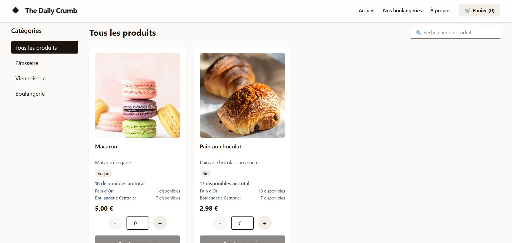

# Boulangerie Artisanale


A modern, full-stack e-commerce platform for artisanal French bakeries, featuring online ordering, bakery management, and multi-location support.

🌐 **Live Website**: [Visit The Daily Crumb](https://njs-mu.vercel.app)


## 🌟 Features

###  Customer Experience
- **Online Ordering System** - Browse and order fresh bakery products
- **Interactive Map** - Find bakery locations with Leaflet integration
- **Real-time Product Availability** - Live inventory updates
- **Secure Payments** - Stripe integration for safe transactions
- **Order Tracking** - Real-time order status updates
- **Mobile Responsive** - Optimized for all devices

###  Bakery Management
- **Multi-bakery Support** - Manage multiple locations from one platform
- **Admin Dashboard** - Complete bakery management interface
- **Product Management** - Add, edit, and archive products
- **Order Management** - Process and track customer orders
- **Analytics & Stats** - Business insights and reporting
- **Staff Authentication** - Secure admin access with NextAuth

###  Modern UI/UX
- **Smooth Animations** - Framer Motion & GSAP powered interactions
- **Beautiful Design** - Tailwind CSS with custom styling
- **Interactive Elements** - Tilted cards, split text animations
- **Dynamic Backgrounds** - Interactive dot grid effects

##  Technology Stack


### Core Technologies
- **Frontend**: Next.js 15, React 19, TypeScript
- **Backend**: tRPC, Prisma ORM, NextAuth.js
- **Database**: PostgreSQL with Prisma migrations
- **Styling**: Tailwind CSS 4.0
- **Animations**: Framer Motion, GSAP
- **Maps**: React Leaflet
- **Payments**: Stripe
- **Email**: Resend
- **Authentication**: NextAuth.js with Prisma adapter

###  Hosting & Infrastructure
- **Application**: Hosted on **Vercel** for optimal Next.js performance
- **Database**: PostgreSQL hosted on **Render** for reliable data management
- **CDN**: Vercel's global edge network for fast content delivery

##  Project Structure

```
sbsm/
├── prisma/                 # Database schema and migrations
├── public/
│   └── images/             # Product and bakery images
├── src/
│   ├── app/                # Next.js 13+ App Router
│   │   ├── admin/          # Admin dashboard pages
│   │   ├── animation/      # Reusable animation components
│   │   ├── api/            # API routes and tRPC endpoints
│   │   ├── _components/    # Shared React components
│   │   └── [pages]/        # Public pages
│   ├── server/             # Server-side code
│   │   ├── api/            # tRPC routers
│   │   ├── auth/           # Authentication configuration
│   │   └── db.ts           # Database connection
│   └── styles/             # Global styles
└── scripts/                # Database setup and utility scripts
```

##  Quick Start

### Prerequisites
- Node.js 18+ 
- PostgreSQL database
- npm or yarn

### Installation

1. **Clone the repository**
   ```bash
   git clone [repository-url]
   cd NDS/sbsm
   ```

2. **Install dependencies**
   ```bash
   npm install
   ```

3. **Set up environment variables**
   ```bash
   cp .env.example .env
   ```
   
   Configure your `.env` file with:
   ```env
   DATABASE_URL="postgresql://..."
   NEXTAUTH_SECRET="your-secret-key"
   NEXTAUTH_URL="http://localhost:3000"
   STRIPE_SECRET_KEY="sk_..."
   STRIPE_WEBHOOK_SECRET="whsec_..."
   RESEND_API_KEY="re_..."
   ```

4. **Set up the database**
   ```bash
   npm run db:push
   npm run db:generate
   ```

5. **Seed initial data** (optional)
   ```bash
   node scripts/setup-bakeries.js
   ```

6. **Start the development server**
   ```bash
   npm run dev
   ```

Open [http://localhost:3000](http://localhost:3000) to see the application.


## 📱 Screenshots

<div align="center">

###  Homepage
*Elegant landing page with smooth animations and bakery specialties showcase*


---

###  Order System  
*Intuitive product browsing and ordering interface*



---

###  Interactive Map
*Find bakery locations with integrated map functionality*


---

###  Admin Dashboard
*Complete bakery management interface*


</div>

##  Available Scripts

```bash
# Development
npm run dev           # Start development server
npm run build         # Build for production
npm run start         # Start production server

# Database
npm run db:generate   # Generate Prisma client
npm run db:push       # Push schema to database
npm run db:studio     # Open Prisma Studio
npm run db:migrate    # Run migrations

# Code Quality
npm run lint          # Run ESLint
npm run typecheck     # Type checking
```

##  API Endpoints

### Public API
- `GET /api/products` - Get available products
- `POST /api/checkout` - Process orders
- `GET /api/bakery/[id]` - Get bakery information

### Admin API
- `POST /api/admin/login` - Admin authentication
- `GET /api/admin/stats` - Business analytics
- `POST /api/bakery/[id]/products` - Manage products
- `GET /api/bakery/[id]/orders` - View orders

##  Authentication & Authorization

- **Customer Access**: Public browsing, order placement
- **Bakery Staff**: Product management, order processing  
- **Admin**: Full system access, analytics, multi-bakery management

##  Deployment

### Current Production Setup
- **Frontend & API**: Deployed on **Vercel** with automatic deployments from Git
- **Database**: PostgreSQL hosted on **Render** with automatic backups
- **Domain**: Custom domain with SSL certificate
- **Environment**: Production environment variables configured in Vercel dashboard


Ensure environment variables are properly configured in your deployment environment.


---


